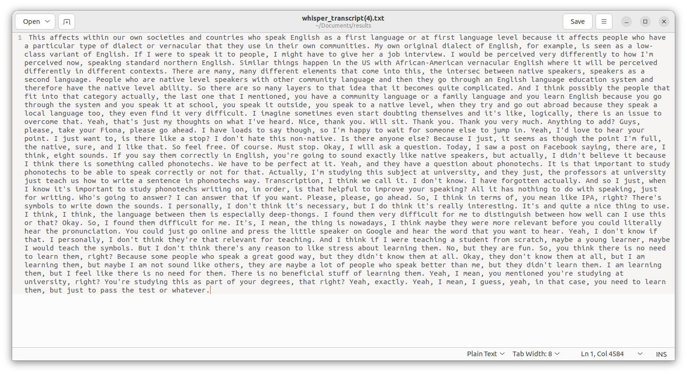
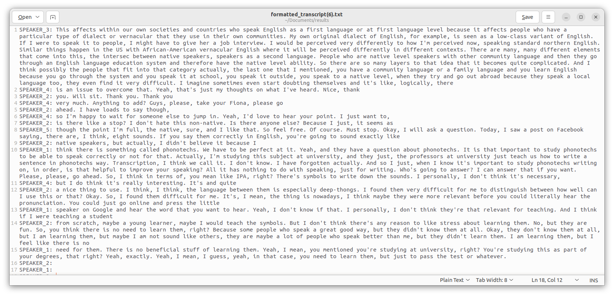
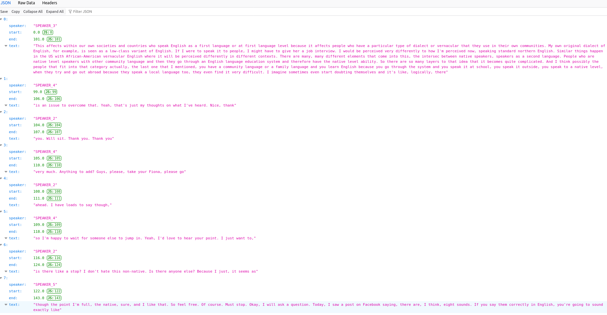
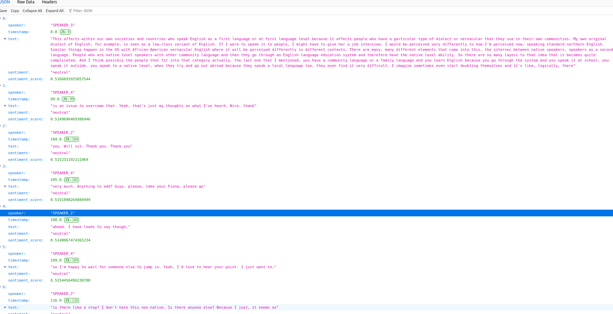
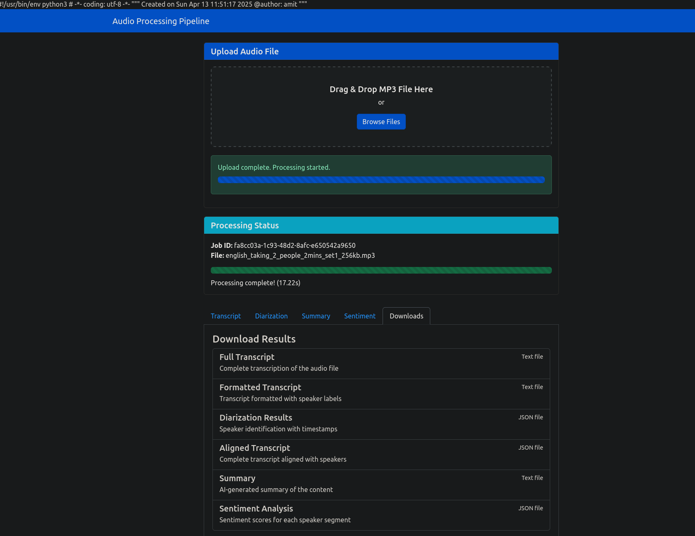

# 📞 Call Analyzer

## 🔥 Project Overview

We have built a **Call Analyzer** which helps companies that provide calling services to analyze conversations effectively. The system takes an audio or call recording between two or more people and processes it through a series of AI models and tools to produce a structured and insightful analysis.

We have also done local hosting of our **AI Audio Processing Web Application** using Flask, which connects all backend models and serves results through a simple HTML frontend.

---

## 📌 Call Analyzer Flow

---

## ⚙️ Modules and Workflow

### 1. 🎧 Audio to Text Transcription

* **Model Used:** Fine-tuned [Whisper-Base](https://github.com/openai/whisper)
* **Testing Code:** [whisper\_testingFinal.py](Ai_model_testing_individually/whisper_testingFinal.py)
* **Input Audio File:** [english\_taking\_4\_people\_5mins\_set3.mp3](Results/english_taking_4_people_5mins_set3.mp3)
* **Output Transcript:** [whisper\_transcript(4).txt](Results/whisper_transcript%284%29.txt)
* **Purpose:** Converts audio into readable text.

### 2. 📝 Formatted Transcript

* Converts the raw transcript into a more human-readable and structured format.
* **Formatted Transcript:** [formatted\_transcript(6).txt](Results/formatted_transcript%286%29.txt)

### 3. 🗣️ Speaker Diarization

* **Tool Used:** [pyannote-audio](https://github.com/pyannote/pyannote-audio)
* **Testing Code:** [speech\_brain\_tested.py](Ai_model_testing_individually/speech_brain_tested.py)
* **Input Audio File:** [english\_taking\_4\_people\_5mins\_set3.mp3](Results/english_taking_4_people_5mins_set3.mp3)
* **Diarization Output:** [diarization\_result(5).json](Results/diarization_result%285%29.json)
* **Purpose:** Identifies “who spoke when” in the conversation.

### 4. 🔗 Aligned Transcript

* Combines:

  * Formatted transcript
  * Speaker diarization results
* **Output:** [aligned\_transcript(4).json](Results/aligned_transcript%284%29.json)
* **Purpose:** Creates a full transcript with speaker attribution.

### 5. 💬 Sentiment Analysis

* **Model Used:** [Indic-BERT](https://huggingface.co/ai4bharat/indic-bert)
* **Testing Code:** [indicBERT\_tested.py](Ai_model_testing_individually/indicBERT_tested.py)
* **Input:** Aligned speaker-labeled transcript
* **Output:** [sentiment\_results(4).json](Results/sentiment_results%284%29.json)

  * Sentiment (Positive, Negative, Neutral)
  * NPS (Net Promoter Score)

### 6. 🧾 Summary Generation

<!-- Summary generation does not have an image provided -->

* **Model Used:** Fine-tuned [T5 (Text-to-Text Transfer Transformer)](https://huggingface.co/models)
* **Testing Code:** [T5(fine-tuned)\_testing\_done.py](Ai_model_testing_individually/T5%28fine-tuned%29_testing_done.py)
* **Fine-tuning Code:** [fine\_tune\_t5C.py](googel-T5_fine-tuning/fine_tune_t5C.py)
* **Input:** Sentiment-analyzed transcript
* **Output Summary:** [summary\_output(3).txt](Results/summary_output%283%29.txt)
* **Purpose:** Quickly helps companies understand the nature and outcome of the call.

---

## 📁 Results

We have tested the pipeline with real audio files. All results and inputs are available here:

* [Test Audio](Results/english_taking_4_people_5mins_set3.mp3)
* [Whisper Transcript](Results/whisper_transcript%284%29.txt)
* [Formatted Transcript](Results/formatted_transcript%286%29.txt)
* [Speaker Diarization Output](Results/diarization_result%285%29.json)
* [Aligned Transcript](Results/aligned_transcript%284%29.json)
* [Sentiment Analysis Results](Results/sentiment_results%284%29.json)
* [Summary](Results/summary_output%283%29.txt)

---

## 🖥️ **Local Hosting**

### 1. 🧠 AI Audio Processing Pipeline

Created an orchestration pipeline in Python which integrates all the models as illustrated in the flow diagram.

* **Pipeline Code:** [audio\_preprocessing\_coordinator.py](Ai_pipeline/audio_preprocessing_coordinator.py)
* **Whisper Model Download:** [to\_download\_whisper.py](AI_model_downloaded_to_system/to_download_whisper.py)
* **SpeechBrain Model Download:** [To\_downloaded\_speechbrain.py](AI_model_downloaded_to_system/To_downloaded_speechbrain.py)
* **Indic-BERT Model Download:** [indic\_bert.py](AI_model_downloaded_to_system/indic_bert.py)
* **T5 Fine-tuning Code:** [fine\_tune\_t5C.py](googel-T5_fine-tuning/fine_tune_t5C.py)

The pipeline takes a single audio input and processes it through the AI models. All interactions between modules are handled through a REST API in the backend.

### 2. 🔙 Backend

**Pipeline API Logs:** [pipeline.log](pipeline.log)

* **REST API File:** [pipeline\_api.py](backend/pipeline_api.py)
* **Backend Integration:** [Audio\_\_pipeline\_backend\_integeration.py](backend/Audio__pipeline_backend_integeration.py)
* Performs `GET` and `POST` requests to receive and respond to audio input from the frontend.

### 3. 🌐 Frontend

* **Main App Connector:** [app.py](frontend/app.py)
* **HTML UI File:** [index.html](frontend/index.html)
* Allows users to upload audio, trigger analysis, and view results through HTTP communication with the backend.

---

Let me know if you want to add image references for backend/frontend structure or a deployment guide!
